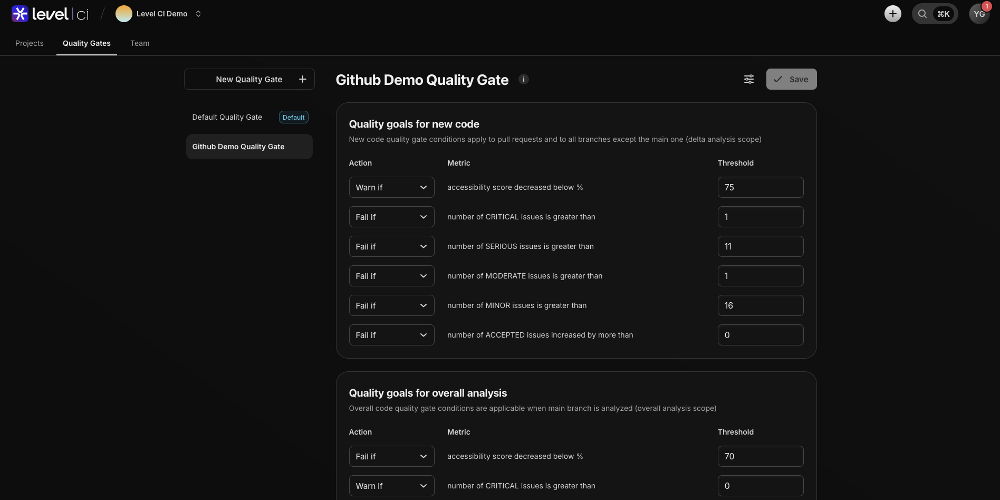

# Level CI Demo

This repository demonstrates how **Level CI** integrates accessibility testing directly into your development workflow.  

Instead of treating accessibility as an afterthought, Level CI embeds scans into your **pipelines, pull requests, and dashboards**—helping teams **catch issues early** and **remediate faster**.

---

## Quality Gates
Quality Gates ensure that accessibility is part of your definition of “done.” 

- Thresholds can be customized per org/project.  
- Demo shows a gate blocking non-compliant code and passing compliant builds.  

📸 *Screenshot: Quality Gate*  

---

## Main Branch Scan
Every commit to the `main` branch is scanned automatically to keep your baseline clean.  

📸 *Screenshot: Main branch scan results*  

---

## Accessibility Run in Pipeline
Accessibility checks run as part of your CI pipeline alongside functional and unit tests.  

- Scans rendered HTML for accessibility violations.  
- Provides actionable issue details directly in CI logs.  
- Ensures no regressions slip through.  

📸 *Screenshot: Pipeline run with accessibility scan*  

---

## Pull Requests

Pull Requests are where Level CI shines—providing **shift-left feedback** before code merges.  

### Failing PR with AI Code Remediation
- Violations are detected.  
- Quality Gate blocks the merge.  
- **AI Code Remediation suggestions** are surfaced directly in the PR for faster fixes.  

📸 *Screenshot: PR failing with remediation*  

---

### Passing PR without AI Code Remediation
- Clean code, no violations.  
- Quality Gate passes, merge allowed.  

📸 *Screenshot: Passing PR*  

---

## Level CI Dashboard – PR Scan for New Code
The dashboard highlights:  
- New violations introduced by the PR.  
- Comparison against baseline scans.  
- Remediation status across branches and teams.  

*Screenshot: PR scan dashboard*  

---

**End Result**  
Level CI empowers developers and QA to **catch issues earlier, fix them faster, and ship accessible code confidently.**
